## Atajos

Ctrl + R = Buscar comandos desplegados

Ctrl + Z(o control + C) = Forzar apagado del commando
 

## Codigo

### rm

```bash
rm *."extension archivo" #Borra todos los archivos con dicha extension
```

### ls

```bash
ls -a #Muestra archivos ocultos

ls -R #Muestra los archivos de manera recursiva
```

### cd

```bash
cd "directorio" #Nos mueve al directorio seleccionado

cd .. #Nos mueve al directorio anterior

cd / #Nos mueve al directorio raiz del sistema
```

### cat 

```bash
cat "archivo" #Muestra el contenido de un archivo
```

### grep

```bash
grep "Buscar" Archivo #Grep busca la palabra "Buscar" dentro del archivo 

grep "^Buscar" Archivo #Grep busca la palabra "Buscar" dentro del archivo en la primera linea con ^.

grep "Buscar$" Archivo #Grep busca la palabra "Buscar" dentro del archivo en la ultima linea con $.

grep "^$" Archivo #buscar las lineas vacias

grep -v #borrar linea
```


### head

```bash
head "archivo" #Muestra el contenido empezando desde el principio 

head -n "numero de lineas" "archivo" #Imprime el numero de lineas dado a partir de la primera linea del archivo que le demos
```

### man

```bash
man "Comando" #Manual de ayuda de cada Comando
```


### tail
```bash
tail "archivo" #Muestra el contenido empezando desde el final

tail -n "numero de lineas" "archivo" #Imprime el numero de lineas dado a partir de la ultima linea del archivo que le demos```
```

### wc
```bash
wc "archivo" #word count, sirve pa contar letras

wc -l "archivo" #numero de lineas

wc -w "archivo" #numero de palabras

wc -c "archivo" #numero de bytes
```

### sort
```bash
sort  "archivo" #te ordena los numeros como caracteres por orden alfabético

sort > "archivo" #te redirige la salida de sort a un texto ordenado
``` 

### less

```bash
less #Muestra Resumen
```

### Sed
```bash
Sed 's/regexp/replacement/' #sirve para reemplazar  un archivo por otro

Sed '/^$/d/' #sirve para borrar las lineas vacias
```
### Uniq 
    
```bash
 uniq "archivo" #quita duplicados de texto
```
### Diff

```bash
diff "archivo1" "archivo2"
``` #compara archivos de texto.
diff -r ""
```
```bash
sed #lineas que quieres modificar d/` #sirve para borrar 
```
```bash
sed  `#lineas que quieres modificar s/` #sirve para sustituir
```

## Pipes

Comando de entrada | Comando de Salida 

Ejemplo:
```bash
grep --help | less
```

Comando de entrada > Salida en archivo

Ejemplo:
```bash
grep --help > test.txt
```


# Leo:

Ej1:


Ej2:
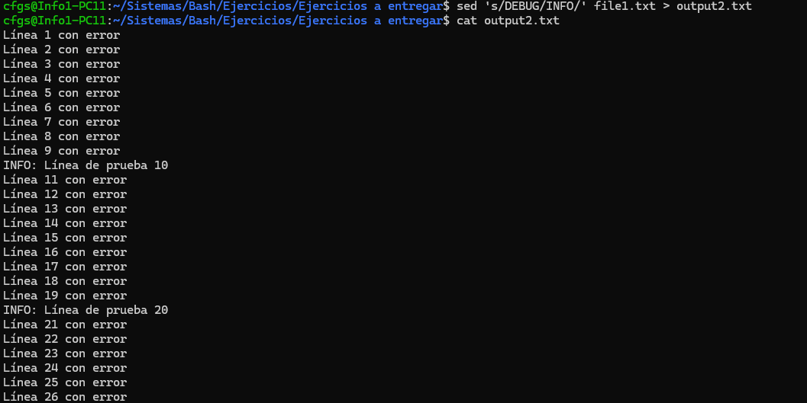

Ej3:
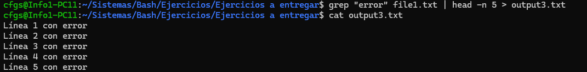

Ej4:
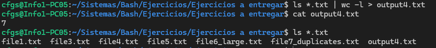

Ej5:
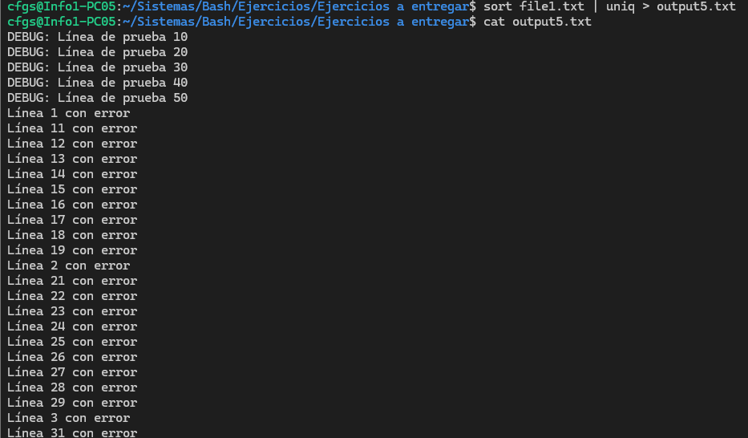

Ej6:


Ej7:
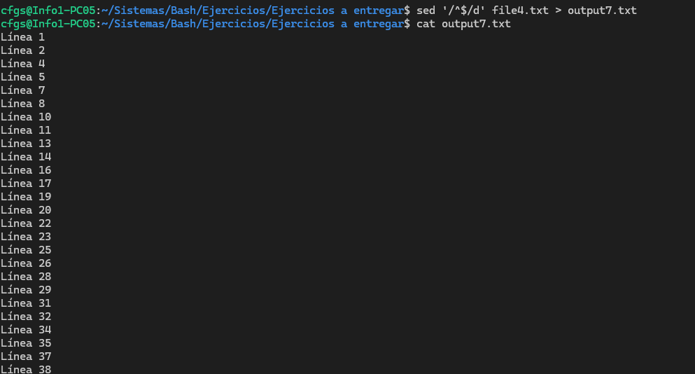

Ej8:
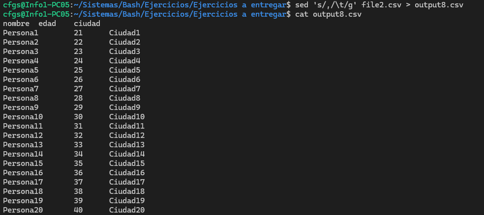

Ej9:
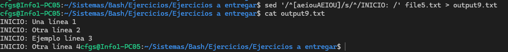

Ej10:
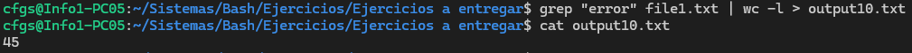

Ej11:
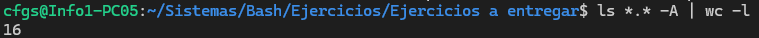

Ej12:
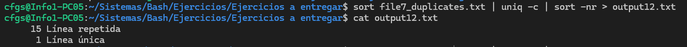

Ej13:
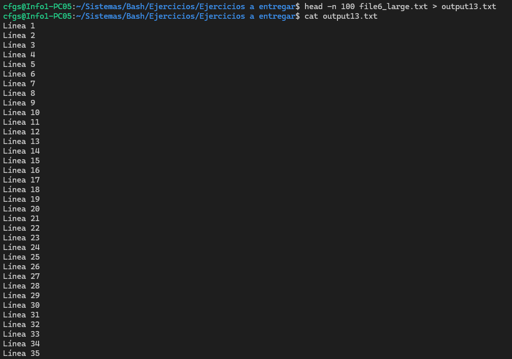

Ej14:
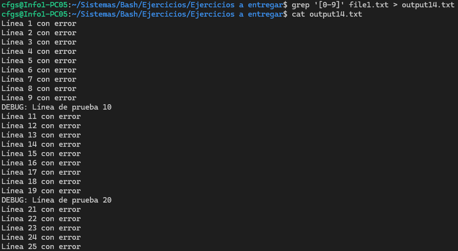

Ej15:
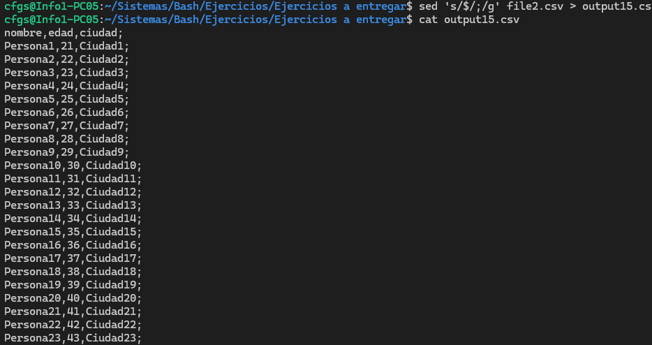

Ej16:
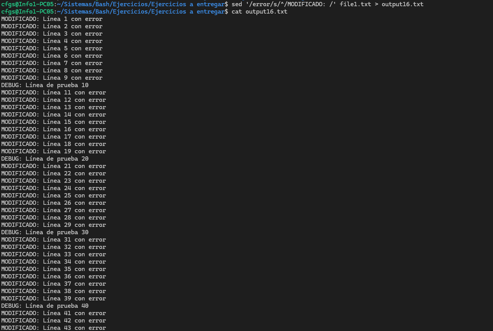

Ej17:
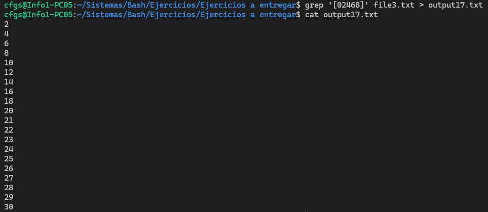

Ej18:
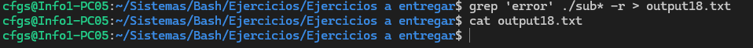

Ej19:
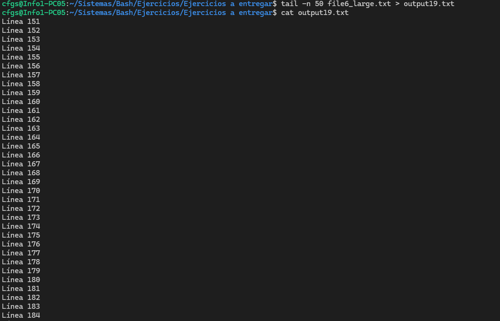

Ej20:
