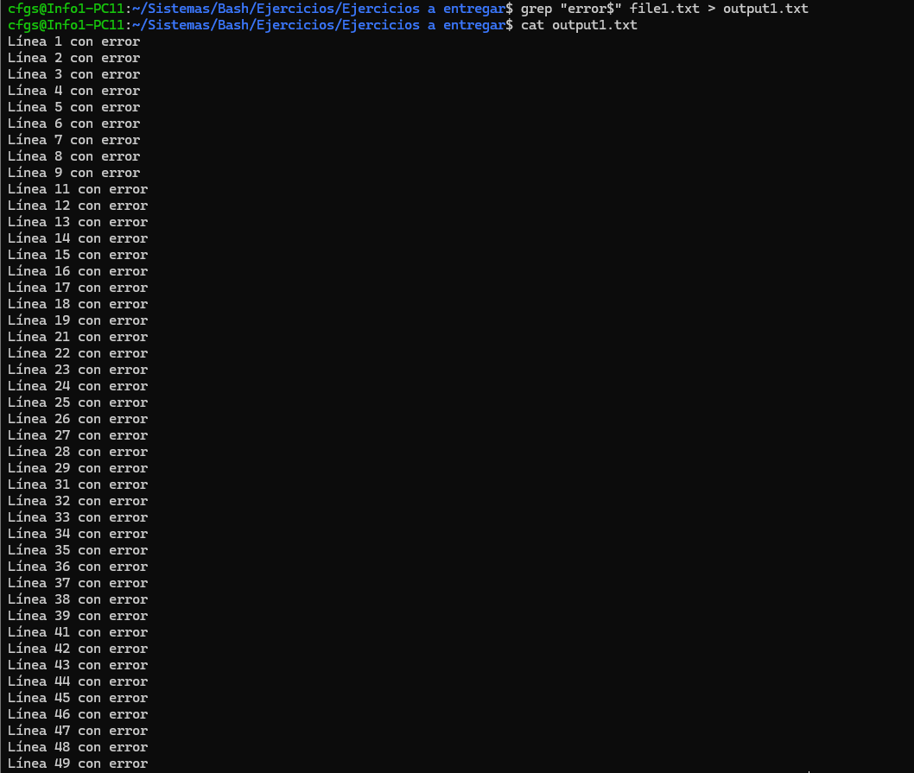

## Atajos

Ctrl + R = Buscar comandos desplegados

Ctrl + Z(o control + C) = Forzar apagado del commando
 

## Codigo

### rm

```bash
rm *."extension archivo" #Borra todos los archivos con dicha extension
```

### ls

```bash
ls -a #Muestra archivos ocultos

ls -R #Muestra los archivos de manera recursiva
```

### cd

```bash
cd "directorio" #Nos mueve al directorio seleccionado

cd .. #Nos mueve al directorio anterior

cd / #Nos mueve al directorio raiz del sistema
```

### cat 

```bash
cat "archivo" #Muestra el contenido de un archivo
```

### grep

```bash
grep "Buscar" Archivo #Grep busca la palabra "Buscar" dentro del archivo 

grep "^Buscar" Archivo #Grep busca la palabra "Buscar" dentro del archivo en la primera linea con ^.

grep "Buscar$" Archivo #Grep busca la palabra "Buscar" dentro del archivo en la ultima linea con $.

grep "^$" Archivo #buscar las lineas vacias

grep -v #borrar linea
```


### head

```bash
head "archivo" #Muestra el contenido empezando desde el principio 

head -n "numero de lineas" "archivo" #Imprime el numero de lineas dado a partir de la primera linea del archivo que le demos
```

### man

```bash
man "Comando" #Manual de ayuda de cada Comando
```


### tail
```bash
tail "archivo" #Muestra el contenido empezando desde el final

tail -n "numero de lineas" "archivo" #Imprime el numero de lineas dado a partir de la ultima linea del archivo que le demos```
```

### wc
```bash
wc "archivo" #word count, sirve pa contar letras

wc -l "archivo" #numero de lineas

wc -w "archivo" #numero de palabras

wc -c "archivo" #numero de bytes
```

### sort
```bash
sort  "archivo" #te ordena los numeros como caracteres por orden alfabético

sort > "archivo" #te redirige la salida de sort a un texto ordenado
``` 

### less

```bash
less #Muestra Resumen
```

### Sed
```bash
Sed 's/regexp/replacement/' #sirve para reemplazar  un archivo por otro

Sed '/^$/d/' #sirve para borrar las lineas vacias
```
### Uniq 
    
```bash
 uniq "archivo" #quita duplicados de texto
```
### Diff

```bash
diff "archivo1" "archivo2"
``` #compara archivos de texto.
diff -r ""
```
```bash
sed #lineas que quieres modificar d/` #sirve para borrar 
```
```bash
sed  `#lineas que quieres modificar s/` #sirve para sustituir
```

### Pipes

Comando de entrada | Comando de Salida 

Ejemplo:
```bash
grep --help | less
```

Comando de entrada > Salida en archivo

Ejemplo:
```bash
grep --help > test.txt
```


# Leo:

### 1: Encuentra todas las líneas que terminen con "error" en el archivo `file1.txt` y guarda el resultado en `output1.txt`.
```bash
grep "error$" file1.txt > output1.txt
```



### 2: Reemplaza todas las ocurrencias de "DEBUG" por "INFO" en el archivo `file1.txt` y guarda el resultado en `output2.txt`.
```bash
sed 's/DEBUG/INFO/' file1.txt > output2.txt
```


### 3: Muestra las primeras 5 líneas de `file1.txt` que contengan "ERROR" y guarda el resultado en `output3.txt`.
```bash
grep "error$" file1.txt | head -n 5 > output3.txt
```


### 4: Cuenta el número de archivos `.txt` en el directorio actual y guarda el resultado en `output4.txt`.
```bash
ls *.txt |wc -l > output4.c
```


### 5: Ordena las líneas del archivo `file1.txt` alfabéticamente, elimina duplicados, y guarda el resultado en `output5.txt`.
```bash
sort file1.txt | uniq  > output5
```


### 6: Divide el archivo `file6_large.txt` en dos archivos: uno con las primeras 100 líneas (`out6.1.txt`) y otro con el resto (`out.6.txt`). 
```bash
head -n 100 file6_large.txt > out6.1.txt | tail -n 100 file6_large > out6.2.txt
```


### 7: Elimina todas las líneas en blanco del archivo `file4.txt` y guarda el resultado en `output7.txt`.
```bash
sed '/^$/d/' file4.txt > output7.txt
```


### 8: Reemplaza todas las comas por tabulaciones en el archivo `file2.csv` y guarda el resultado en `output8.csv`.
```bash
sed 's/,/\t/g' file2.csv > output8.csv
```


### 9: Inserta el prefijo "INICIO:" antes de cada línea que comience con una vocal en el archivo `file5.txt` y guarda el resultado en `output9.txt`.
```bash
sed '/^[AEIOUaeiou]/s/^/INICIO: /' file5.txt > output9.txt
```


### 10: Cuenta cuántas líneas en el archivo `file1.txt` contienen la palabra "ERROR" y guarda el resultado en `output10.txt`.
```bash
grep "error" file1.txt | wc -l > output10.txt
```


### 11: Crea un script que muestre el número total de archivos en el directorio actual y escribe el resultado en `output11.txt`.
```bash
ls *.* -A | wc -l > output11.txt
```


### 12: Encuentra líneas duplicadas en el archivo `file7_duplicates.txt`, muestra cuántas veces se repiten, y guarda el resultado en `output12.txt`.
```bash
sort file7_duplicates.txt | uniq -c | sort -nr > output12.txt
```


### 13: Extrae las primeras 100 líneas del archivo `file6_large.txt` y guarda el resultado en `output13.txt`. 
```bash
head -n 100 file6_large.txt > output13.txt
```


### 14: Busca todas las líneas que contengan números en el archivo `file1.txt` y guarda el resultado en `output14.txt`.
```bash
grep '[0-9]' file1.txt > output14.txt
```


### 15: Convierte el archivo `file2.csv` en un archivo delimitado por punto y coma y guarda el resultado en `output15.csv`. 
```bash
sed 's/$/;/g' file2.csv > output15.csv
```


### 16: Inserta un prefijo "MODIFICADO:" antes de las líneas que contengan la palabra "ERROR" en el archivo `file1.txt` y guarda el resultado en `output16.txt`. 
```bash
sed '/error/s/^/MODIFICADO: /' file1.txt > output16.txt
```


### 17: Extrae las líneas del archivo `file3.txt` que contengan números pares y guarda el resultado en `output17.txt`. 
```bash
grep '[02468]' file3.txt > output17.txt
```


### 18: Busca recursivamente en todos los subdirectorios del directorio actual archivos que contengan la palabra "ERROR" y guarda las coincidencias en `output18.txt`.
```bash
grep 'error' ./sub* -r > output18.txt
```


### 19: Extrae las últimas 50 líneas del archivo `file6_large.txt` y guarda el resultado en `output19.txt`.
```bash
tail -n 50 file6_large.txt > output19.txt 
```


### 20: Lista todos los archivos, incluidos los ocultos, de forma recursiva desde el directorio actual y guarda el resultado en `output20.txt`.
```bash
ls -R | wc -l > output20.txt
```
